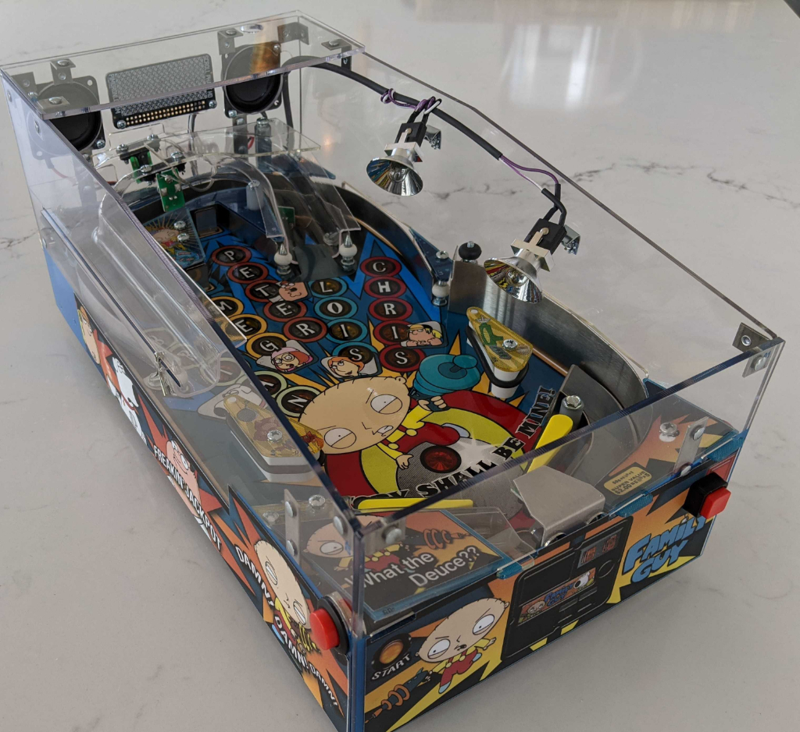
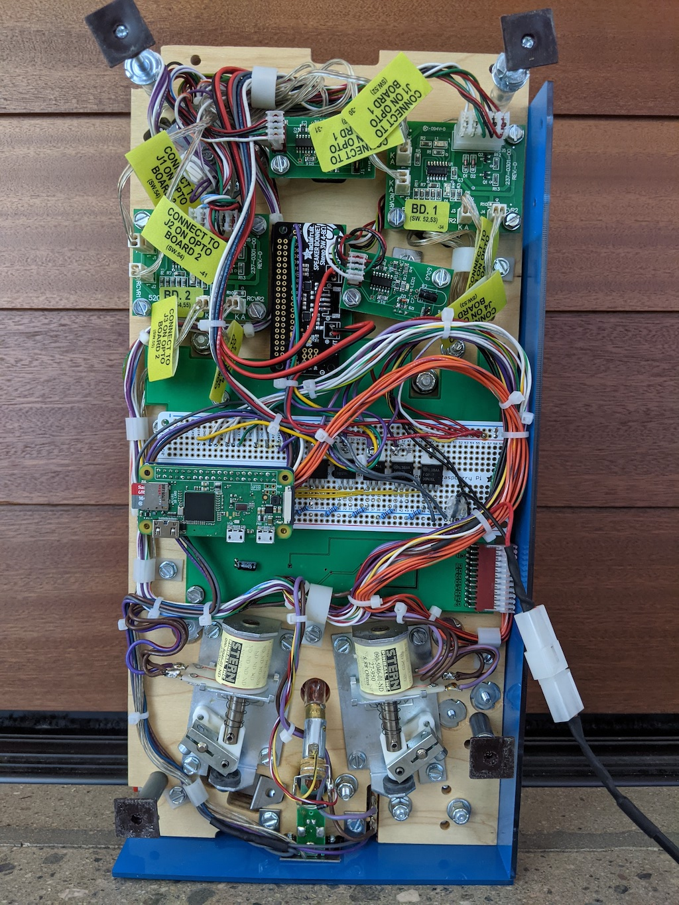
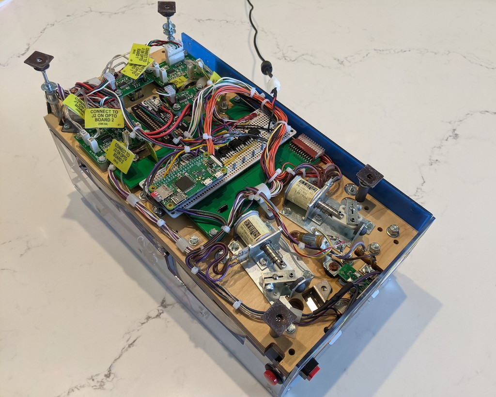

# stewie-pinball
Stewie mini pinball machine as a WiFi connected stand-alone desktop toy. 

https://sternpinball.com/game/family-guy/

https://youtu.be/Mf2ijYRtEzU

https://youtu.be/dwQbJAziybQ 

https://youtu.be/de2w1HFm3PM

<table><tr>
<td></td>
<td rowspan="2"></td>
</tr>
<tr><td></td></tr>
</table>

## Hardware
* Raspberry [Pi Zero W](https://www.raspberrypi.org/products/raspberry-pi-zero-w/)
* I2C MCP23017 [Adafruit GPIO Expander](https://learn.adafruit.com/gpio-expander-bonnet)
* I2C 17x7 LED matrix with PWM IS31FL3731 [PiMoroni ScrollPhatHD](https://shop.pimoroni.com/products/scroll-phat-hd)
* PCM 3W DAC MAX98357 [Adafruit Stereo Speaker Bonnet](https://www.adafruit.com/product/3346)
* Solenoid and lamp MOSFETs [IRLB8721](https://cdn-shop.adafruit.com/datasheets/irlb8721pbf.pdf)

### Pin usage

| GPIO | Description | Usage |
| ---- | ----------- | ----- |
|    0 | ee_sda2     | reserved |
|    1 | ee_scl2     | reserved |
|    2 | i2c_sda     | mcp23017_sda + is21fl371_sda |
|    3 | i2c_scl     | mcp23017_scl + is21fl371_scl |
|    4 | gpclk0      | fet solenoid flipper left |
|    5 | gpclk1      | fet lamp shoot again |
|    6 | gpclk2      | playfield led clock |
|    7 | spi0_ce1    | switch drive_signal |
|    8 | spi0_ce0    | switch shooter |
|    9 | spi0_miso   | switch flipper right |
|   10 | spi0_mosi   | switch start |
|   11 | spi0_clk    | switch flipper left |
|   12 | pwm_0       | switch brian_chris |
|   13 | pwm_1       | |
|   14 | txd         | |
|   15 | rxd         | |
|   16 | spi1_ce2    | switch chris_brian |
|   17 | spi1_ce1    | fet solenoid flipper right |
|   18 | spi1_ce0    | |
|   19 | pmc_fs      | audio bonnet pcm fs |
|   20 | pmc_din     | |
|   21 | pmc_dout    | audio bonnet pcm dout |
|   22 | sdio_clk    | fet lamp playfield gi |
|   23 | sdio_cmd    | switch lois |
|   24 | sdio_dat0   | switch meg |
|   24 | pmc_clk     | audio pcm clk |
|   25 | sdio_dat1   | switch peter |
|   26 | sdio_dat2   | |
|   27 | sdio_dat3   | fet solenoid shooter |
    

## Game operation
There are only 5 shots and each shot has a corresponding switch. The Peter and Brian shots share a loop so the sequence of the two opto switches triggering determines which shot is taken. Besides these switches, the only other input to game play is time. Outputs include all 22 playfield lamps and the LED display.

### Attract mode
All 22 playfield lamps are strobbed in various *attractive* sequences. 

### Start mode
When the game is first started each shot is lit in sequence. Which ever is hit selects the play mode.

### Peter mode

Regular Stewie pinball mode from Family Guy. 30 second timer to hit all 22 playfield lamps for big bonus and light show. Draining results in auto plunge only. Mode is ended at timer expiration.

### Meg mode

Shoot each family member (hit each column once). The mode ends when the ball drains.

### Lois mode

Flipper energy, inspired by King Pin. Collect every family member. Flipper power decreases with each shot. Draining results in auto plunger, mode is ended by zero flip power.

### Chris mode

Evil monkey song plays. Shoot the monkey. A whole column is randomly lit if it's hit double points are awarded. If a 5 second timeout is reached then a new column is chosen. The mode ends when the ball drains.

### Brian mode

Quick Draw, inspired by Cactus Canyon. Lights and flippers are out. Ball centers in trough. Old west song plays. A whole column is randomly lit, on the third lights on and "draw". Points are awarded if it's hit within 5 seconds. Otherwise back to start mode.

